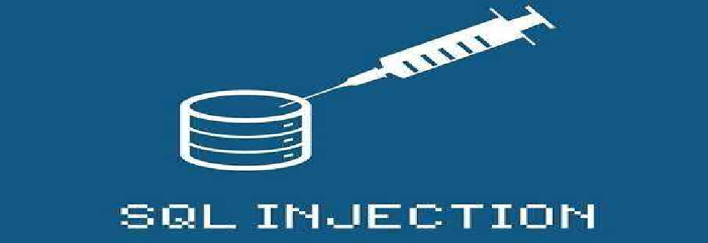
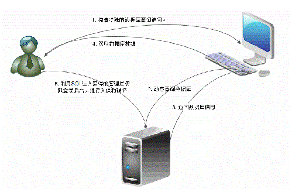

## SQL注入简介

### (1.) 简介：

​	SQL注入是指Web应用程序对用户输入数据的合法性未进行合理的判断或处理，前端传入的参数是攻击者可控的，并且参数被正常的带入到数据库查询，攻击者可以通过构造不同的SQL语句来进行对数据库的操作，正常情况下，攻击者可以对数据库进行高危操作，例如，数据查询、WebShell写入、命令执行等操作。

​	

### (2.) SQL注入分类：

​	按照不同角度SQL注入又分为不同的类型：

- ##### **按照不同数据库分类：**

  - MySQL注入

  - Oracle注入

  - MsSQL注入(SQLServer)

  - Access注入

  - DB2注入

    ......

- ##### **按照注入点类型**分类

  - 数字型注入：
  - 字符型注入：
  - 搜索型注入：

- ##### **按照提交方式及数据位置分类**

  - GET型注入：使用GET方法的注入类型。
  - POST型注入：使用POST方法的注入类型。
  - HTTP头注入：注入点在 HTTP 请求头部的某个字段中，通常包含以下几种。
    - COOKIE型注入：HTTP 请求的时候会带上客户端的 Cookie, 注入点存在 Cookie 当中的某个字段中。
    - XFF（X-Forwarded-For）注入：HTTP请求中的X-Forwarded-For字段，通过修改X-Forwarded-for头对带入系统的dns进行SQL注入，通常一些网站的防注入功能会记录请求端真实IP地址并写入数据库或文件种，可以通过修改XFF头伪造真实IP..
    - Clien-IP：作用同XFF。
    - User-Agent 注入：有的网站会将客户端使用的操作系统或浏览器版本存入数据库中。

- ##### **按照执行效果及语法**

  - 联合查询注入：可以使用UNION的注入。
  - 堆叠型注入：可以使用 ; 来同时执行多条SQL语句的注入。
  - 报错型注入：页面仅会返回数据库错误信息，或者把注入的语句的结果直接返回在页面中。
  - 布尔型注入：可以根据返回页面来判断条件真假的注入，即页面出错后不会返回错误，可能会是一片空白，或者提示统一的报错信息。
  - 时间型注入：不能根据页面返回内容判断任何信息，用条件语句查看时间延迟语句是否执行延时（通过浏览器时间线）来判断。

### **(3.)   漏洞原理：**

​	这里漏洞的产生需要两个必要的条件：

 +   参数可控
 +   带入数据库进行查询

​																									（图片来自互联网，仅供参考）

### （4.） 漏洞危害：

- 获取WebShell：当权限为root且知道绝对路径时，可以直接写一句话木马到服务器。
- 网页篡改：注入出后台管理员用户，登陆后台后发布恶意数据、篡改后台数据等。
- 网站挂马 : 当拿到WebShell或者获取到服务器的权限后，可将一些网页木马挂在服务器上，去攻击别人。
- 获取系统权限：当权限足够高时，可以获取系统主机的权限。
- 万能密码：利用特定的Payload登录后台或者其他页面。
 - 文件读取：读取f服务器种的敏感文件。
 - 数据库信息泄露：泄露数据库中存放的数据、用户隐私等。

### **(5.)  漏洞修复方式：**

​	**解决SQL注入问题的关键是对所有可能来自用户输入的数据进行严格的检查、对数据库配置使用最小权限原则。**

 - 所有的查询语句都使用数据库提供的参数化查询接口，参数化的语句使用参数而不是将用户输入变量嵌入到SQL语句中。
- 对用户可能会拼接的危险字符进行过滤、转义、编码等处理。
- 对参数变量长度进行限制，可以从一定程度上限制SQL注入的语句长度。
- 前后端都使用统一的编码方式，避免被利用编码特性绕过。
- 避免网站显示SQL错误信息，比如类型错误、字段不匹配等，防止攻击者利用这些错误信息进行一些判断。
- 数据库权限最小化，减少SQL注入后带来的危害。
- 安装一些WAF防护软件，来减少阻止一些SQL注入。

---

#### ***该文章部分内容参考自互联网，写的有些粗糙，欢迎斧正。***

