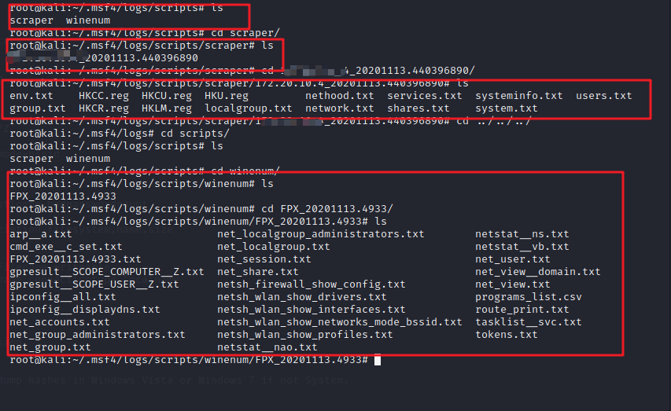

---

#### *当获取到最高权限后，我们可以借助MSF的post模块进行一些信息收集及一些简单的取证，这里总结下常见的post模块中常用的信息收集脚本及模块，我们可以在meterpreter或者在msf中直接使用模块、或者一些信息收集的脚本。*

```
post/windows/gather/forensics/enum_drives				#获取机器分区形况

post/windows/gather/checkvm							   #判断是否为虚拟机

post/windows/gather/enum_services					    #判断开启哪些服务

post/windows/gather/enum_applications				    #查看安装的应用

post/windows/gather/dumplink						   #获取最近的文件操作

post/windows/gather/enum_shares						   #查看共享

post/windows/gather/enum_patche						   #查看补丁信息

post/windows/gather/enum_domain						   #查找域控

 post/windows/gather/smart_hashdump					    #获取hash值（包括域）（需要先将权限提升到system权限）

post/windows/gather/forensics/browser_history			#forensics目录下的脚本主要是用来取证，获取浏览器记录

post/windows/gather/enum_ie 						   #获取IE缓存

post/windows/gather/enum_chrome 					   #获取Chrome缓存

```


或者直接在meterpreter里直接运行下列其中的一个脚本

```
run scraper						#利用脚本收集相关信息，如注册表、hash、网络情况、用户等								  

run	winenum						#常见的信息收集、网络、服务、hash、注册表、用户等	
```

他们的运行结果会保存在下面的目录中，需要注意这些目录下又会生成一个ip或主机名+时间的目录，里面存放了txt文件：

```
/root/.msf4/logs/script/scraper/
/root/.msf4/logs/script/scraper/winenum
```




*ok就这样*

---

